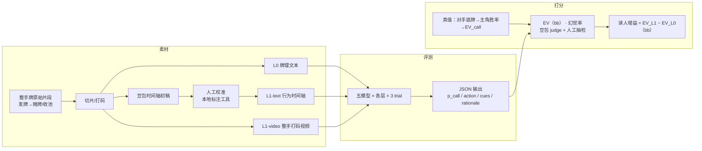

# 读人 Bench（Reading-the-Room Bench）评测框架 v0.2

> 多模态大模型在高真实影响的人际场景中，对他人情绪状态的感知与决策判断能力评测。v1 以德州扑克"对手 all-in → 主角待决"为唯一实例领域。
> 面向：第一届懂模帝 Bench 黑客松（2026-08-22/23），有用赛道主投，兼顾 Qwen 选择奖。
> v0.2 变更（对 v0.1 评论逐条拍板后落实）：主指标 Brier → 期望收益 EV（bb）；分层简化为 L0 / L1-text / L1-video（删抽帧层与音频层）；切片改整手牌；时间轴初稿豆包生成+人工校准（配套本地标注工具）；cue 幻觉核验自动化（豆包 judge + 人工抽检 10–20%）；样本人物尽量不重复；删观众投票与排期章节。

---

## 0. 一页速览

| 项 | 内容 |
|---|---|
| 一句话 | 给模型一整手"对手 all-in、主角待决"的打码牌局（发牌→收池），模型站主角视角输出 call 概率；真值由对手真实底牌算出的主角胜率决定；用分层输入消融证明模型是否真在"读人" |
| 评什么 | 感知线索 → 推断对方状态 → 不确定下校准决策，三步一体 |
| 题量 | 12–15 手，call 正确/错误各半 |
| 模型 | Claude Opus 5 / GPT-5.6 Sol / Qwen3.8-Max / Kimi K3 / DeepSeek V4 Pro（豆包 Seed 2.1 Pro 临时充当 L1-video 被评模型，provisional，正式名单现场定） |
| 主指标 | **期望收益 EV（bb）**：score = p_call × EV(call) + (1−p_call) × 0；头条数字 = 读人增益 = L1 相对 L0 每手多赚多少 bb |
| 真值 | 胜率口径：主角对对手真实底牌的胜率 ≥ 所需赔率 ⇒ call 正确；EV(call) 由该胜率与底池算出 |
| 已拍板 | 给主角底牌；不定义 bluff；时间轴豆包初稿+人工校准（本地标注工具）；cue 幻觉豆包 judge 自动核验+人工抽检 10–20%；人类对照为可选 |

---

## 1. 为什么做这个

- 公开榜单里"视频社交理解"全是选择题（Social-IQ、MMToM-QA、EmoBench-M），"概率预测"全是文本（ForecastBench）；两者叠加在**有客观真值的真实视频**上还没有人做。
- 扑克是理想载体：① 真值免费且客观（RFID 上帝视角底牌 + 胜率可算）；② 决策有真实影响，表情和语气不是表演；③ 选手有公开排名画像可佐证；④ 决策空间被压到 call/fold 两选，题目干净。
- 用 **EV（bb）** 做主指标让分数直接可读：这个模型的"读人"值多少个大盲注——评测结果落在牌手自己的度量衡上。
- 框架领域无关，扑克只是 v1 实例，后续可迁移到谈判、面试、游戏节目真假话等场景。

---

## 2. 框架图



能力分解（领域无关）：

| 层 | 能力 | 扑克里对应 |
|---|---|---|
| 感知 | 捕捉可观察线索 | 表情、姿态、下注动作节奏、语气 |
| 推断 | 线索+语境 → 对方状态 | 对手牌力强弱 |
| 决策 | 不确定下给校准概率 | p_call 与赔率比较 |

---

## 3. 输入定义（分层消融）

| 层 | 内容 | 可用模型 | 目的 |
|---|---|---|---|
| L0 | 牌理文本：桌况、盲注/straddle、双方位置与筹码、主角底牌、完整下注线至 all-in、公共牌、底池、跟注额、所需赔率 | 五家 | 纯牌理基线（"盲答"基线） |
| L1-text | L0 + 行为时间轴文本（豆包初稿、人工校准后） | 五家 | 让纯文本模型也能用上"别人看到的"线索 |
| L1-video | L0 + 整手打码视频（fps 1–2） | Qwen / K3 / 豆包（provisional） | 模型自己看 |

v0.1 → v0.2：**L1-vision（抽帧层）删除**——视频能力已足够普及，抽帧是历史妥协；抽帧脚本保留但仅供标注工具显示用。**L2-audio 删除**。

**不给模型**：选手姓名/排名、对手底牌、任何 HUD 统计。

片段与时间轴约定：
- **切片 = 整手牌**：从发牌（该手首个牌桌镜头）到摊牌/收池前，通常 1–4 分钟。整手保留下注线全程的行为语境（v0.1 的 all-in±几秒丢掉了前三条街的"人"）。
- 打码 = 屏幕底牌 UI、胜率条、outs 条、姓名条、底池面板、logo；广角镜头的多人底牌面板与漂浮标签按时间段打码；实体公共牌与筹码保留。
- **行为时间轴 = 豆包（doubao-seed-2-1-pro-260628）看整手打码视频生成初稿 → 人工在本地标注工具里逐条校准**（编辑/删/补、点条目视频跳转对齐时间）。只写 gaze/posture/hands/speech/chips/face 六类可观察事实，禁情绪词（自动校验），关键长考段 1–2s 一条。进入评测的时间轴必须 human_verified。

---

## 4. 输出定义（固定 JSON）

```json
{
  "p_call": 0.35,
  "action": "fold",
  "cues": [
    {"t": 89.0, "who": "villain", "type": "gaze", "observed": "推注后盯公共牌未看主角", "direction": "strong", "weight": 0.3}
  ],
  "rationale": "≤150 字",
  "recognized": false
}
```

- `p_call`：主指标来源。`action` 由 p_call 是否 ≥ 0.5 导出（模型自报不一致时以 p_call 为准）。
- `cues`：每条必须指向具体时间点与可观察事实，供幻觉核验。
- `recognized`：污染检测——模型是否认出这手牌或这些人；为 true 的题在主指标中剔除并单独报告。

---

## 5. 真值与打分

**真值（胜率口径）**
- `hero_equity`：主角底牌 vs 对手真实底牌，在当前公共牌下的胜率（枚举计算）。
- `required_equity` = 跟注额 / (底池 + 跟注额)。
- `correct_call` = hero_equity ≥ required_equity。
- `EV(call)` =（hero_equity × 全下后底池 −(1−hero_equity) × 跟注额）/ bb；`EV(fold)` = 0。
- 附录保留结果口径（实际行动、实际输赢）但不进主指标。

**主指标（v0.2 拍板：EV 替代 Brier）**

| 指标 | 公式/说明 | 用途 |
|---|---|---|
| **EV（bb）** | score = p_call × EV(call) + (1−p_call) × 0，按题平均 | 主指标，越高越好；上界 = oracle EV（全知最优行动），恒 fold 基线 = 0 |
| **读人增益（bb）** | EV(L1-x) − EV(L0)，同模型对比 | **头条数字：看了人之后每手多赚多少个大盲** |
| 线索幻觉率 | cues 经豆包 judge 对照整手视频核验不存在的比例（uncertain 不计入）；**人工抽检 10–20% 复核 judge，人工改判优先** | 失效分析；judge 只判"有没有"不判"对不对" |
| hard EV / action acc | action = p≥0.5 的硬决策口径 | 辅助视角 |

**附录一行**：Brier（防极端自信，无知基线 0.25）、ECE、3-trial 一致性 std。log loss 与"区分度"指标删除。

**基线**：恒 fold（EV=0）；oracle（全知上界）；L0 文本层（盲答）。

**计分规则**
- 每题每层每模型 3 trial，取 p_call 均值进主指标。
- `recognized = true` 的题剔除。
- 报告同时披露 token 成本与全部 transcript。

---

## 6. 样本设计

| 项 | 约定 |
|---|---|
| 题量 | 12–15 手，留 20 手候选 |
| 平衡 | correct_call 真/假各半 |
| 分层 | **主角/对手尽量不重复**（同一人最多 2 手，且不同对局），防"记人"、防单人风格主导 |
| 来源 | 无解说节目（v1：Poker Night in America / Hellmuth's Home Game 系列）；**所有出镜选手须 Hendon Mob 可查** |
| 难度 | 按 L0 基线分三档（纯牌理就能定 / 边界 / 纯牌理判错），各档都要有 |
| 版权 | 只分发时间戳、处理脚本与打码产物，不分发原片 |

**人工标注/校准环节（v0.2 新增）**：每手牌入题前，在本地可视化标注工具（`annotator/`，四页签）过一遍：
① 手牌信息核对（truth 逐字段确认，可改可重算）② 时间轴校准（豆包初稿逐条编辑，视频跳转对齐）③ 遮罩检查（标记泄露时间点）④ cue 核验（judge 判定人工抽检改判，显示覆盖率）。

---

## 7. 框架约定 vs 技术自由度

| 定死 | 留白 |
|---|---|
| 分层输入的内容边界、不给模型的信息 | 打码区域坐标与分段策略的具体实现 |
| 输出 JSON 字段 | prompt 措辞（但须五模型同一 prompt） |
| 真值口径与主指标（EV, bb） | 胜率枚举实现、bootstrap 实现 |
| 每题 3 trial、污染剔除规则 | 时间轴初稿模型与生成参数（现用豆包） |
| 时间轴须人工校准后才进评测 | 标注工具形态 |
| 幻觉核验：judge 自动 + 人工抽检 10–20% | judge 模型选择与核验 prompt |
| 样本平衡与人物不重复约束 | 候选手牌的最终挑选 |

---

## 8. 报告结构

要求：**引人入胜，框架可调**——按"故事线"写，不按流水账写；以下为默认骨架，现场按结果亮点重排。

开场（一手牌的戏剧性时刻 + "AI 值多少个大盲"）→ 框架与能力分解 → 为什么扑克是好载体 → 数据与打码方法（含标注/校准流程）→ 五模型分层 EV 结果（主表 + 读人增益）→ 失效分析（模型引用了什么线索、幻觉率、judge 与人工抽检的分歧）→ 校准附录（Brier/ECE/一致性）→ 对"多模态情绪/决策判断"的结论 → 框架可迁移性与下一个领域 → 成本与全部产物链接

---

## 9. 交付物与依赖

| 交付物 | 说明 | 依赖 |
|---|---|---|
| 题集 items/ | 12–15 手：整手打码视频 + 校准后时间轴 + truth | 候选手牌定位（PokerNews recap 筛 + 回看）、人工标注四步 |
| 工具链 | fetch/mask/timeline/equity/build_item/runner/scoring，全链路已在 hand_0001 真跑通 | 豆包 ARK key（时间轴/judge/provisional 视频）；DeepSeek 已接真；Claude/GPT/Qwen/Kimi 额度等现场 |
| 标注工具 annotator/ | 本地网页四页签，python3 标准库即起 | 无外部依赖 |
| 跑分报告 | EV 主表 + 读人增益 + 幻觉核验 | 全部题目过人工校准；五家 key 到位 |
| 展示 | 报告 + 现场讲述 | 报告结构 §8 |

---

## 附：参考体系

- 概率计分与对照组：ForecastBench（难度调整、无知基线）；EV 计分参考 PokerEval 关于 action-match 与 EV 背离的警示
- 题目 schema：PokerBench（结构化手牌 + label）
- 多模态社交理解消融：MMToM-QA / Social-IQ 2.0 / MimeQA
- 同构真值来源：DOLOS（游戏节目事后揭晓）
- 方法论：τ-bench pass^k、Anthropic evals 指南（grader 优先确定性）、ClawMark 纯规则打分
